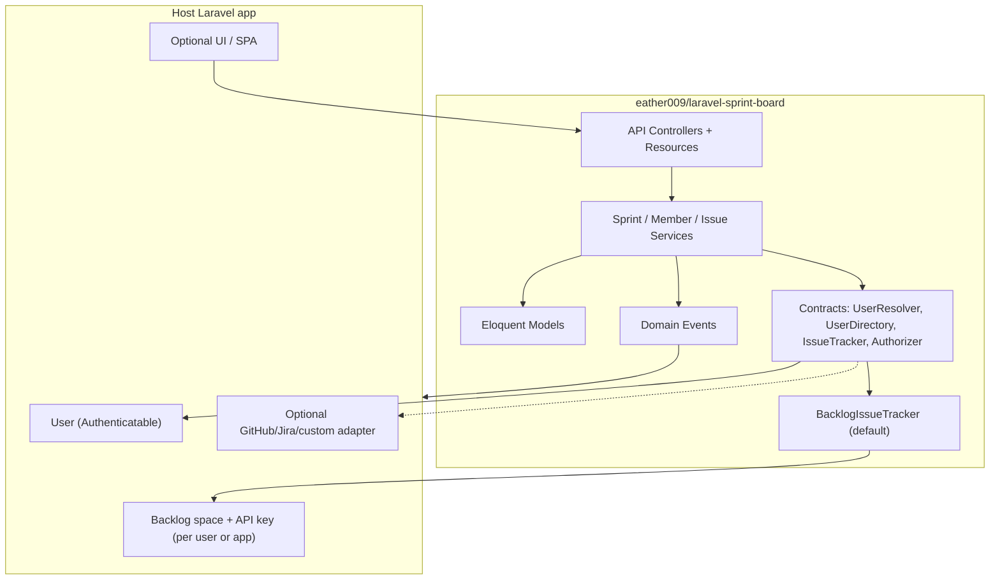

# Plan — Open-source Laravel Sprint Package

**Status:** Decisions locked — ready for Phase 1 after GitHub repo is live  
**Biman work branch:** `plan/laravel-sprint-package` (from `staging`)  
**Package folder (monorepo mirror):** `packages/laravel-sprint-board/`  
**Canonical GitHub repo:** https://github.com/eather009/laravel-sprint-board  
**Date:** 2026-07-24  

> Goal: Extract the **Sprint domain + HTTP API** into a standalone, extendable Laravel package.  
> **Not in scope for v1:** Blade/Alpine UI, Biman session, Tools employees API.  
> **Default issue tracker:** [Backlog](https://backlog.com/) (shipped driver). Other trackers via `IssueTracker` contract.  
> Host apps plug in Auth + optional custom tracker drivers via contracts.

---

## 1. Product intent

Build a reusable package so any Laravel app can:

1. Create / manage **sprints** (dates, goal, status, retrospective)
2. Attach **members** from the host `User` model (leader + members)
3. Link **external issues** (tracker-agnostic refs) with per-member ownership + shared completion
4. Expose a **JSON API** consumers and SPAs can call
5. Extend via **interfaces, events, config, and optional drivers**

Open source from day one (MIT), Packagist-ready. Default tracker is Backlog; core stays swappable.

---

## 2. Package identity (locked)

| Item | Value |
|------|--------|
| GitHub | https://github.com/eather009/laravel-sprint-board |
| Composer name | `eather009/laravel-sprint-board` |
| PHP NS | `Eather009\LaravelSprintBoard\` |
| Folder (Biman mirror) | `packages/laravel-sprint-board/` |
| License | **MIT** |
| Min Laravel | **10.x / 11.x / 12.x** |
| Min PHP | **8.2** |
| Default tracker | **`backlog`** (`BacklogIssueTracker` driver shipped) |

---

## 3. What goes in vs out

### In package (API core)

| Area | Contents |
|------|----------|
| Schema | `sprints`, `sprint_members`, `sprint_issues` (+ indexes) |
| Models | `Sprint`, `SprintMember`, `SprintIssue` |
| Domain services | CRUD, access rules, status resolver, completion, dashboard *aggregates*, summary builders |
| HTTP | API routes + controllers + FormRequests + API Resources |
| Config | Publishable `config/sprint.php` (priorities, widgets, TTLs, table names, user model) |
| Authz | Policy / Gate based on contracts (leader / member / admin) |
| Events | `SprintCreated`, `IssueLinked`, `CompletionUpdated`, … |
| Console | Optional `sprint:sync-external-completion` (no-op without tracker driver) |
| Lang | Package lang keys for API error messages |
| Tests | Orchestra Testbench feature + unit suite |

### Out of package (host / separate packages)

| Area | Why |
|------|-----|
| Blade / Alpine / Gantt CSS / charts | UI is host-specific; can be a *future* `laravel-sprint-ui` |
| Biman `authUser()` / session middleware | Replace with Laravel `Auth` + contract |
| Tools `listEmployees` | Replace with `UserDirectory` contract → default Eloquent User query |
| Host-specific Biman `IssueTrackerService` wiring | Package ships its own `BacklogIssueTracker`; host only supplies API key / space |
| Biman `projects` FK | Drop — not part of package schema |
| Team* legacy | Not part of V1 product; omit |

---

## 4. Architecture



### Design principles

1. **Default tracker = Backlog** — `config('sprint.tracker_default') = 'backlog'`; hydrate/sync/priority use `BacklogIssueTracker` out of the box.
2. **Still swappable** — package stores `tracker` + `external_project_id` + `external_issue_id`; bind another `IssueTracker` implementation to replace or multi-drive.
3. **User = Laravel User** — `leader_id`, `user_id`, `added_by`, `created_by` FK to configurable user model (`config('sprint.user_model')`, default `App\Models\User`).
4. **Credentials stay in the host** — package never hardcodes Backlog keys; host binds a credentials resolver (env / user settings).
5. **Everything extendable** — bind custom Authorizer, Directory, Tracker; listen to events; override routes.
6. **API-first** — versioned JSON under `/api/sprints` (configurable prefix).

---

## 5. ERD / database

```mermaid
erDiagram
  users ||--o{ sprints : "leader / created_by"
  sprints ||--|{ sprint_members : has
  users ||--|{ sprint_members : "member"
  sprints ||--o{ sprint_issues : has
  users ||--o{ sprint_issues : "added_by"

  sprints {
    bigint id PK
    bigint leader_id FK
    bigint created_by FK
    string name
    text goal nullable
    text description nullable
    text planning_note nullable
    json retrospective nullable
    json dashboard_settings nullable
    date start_date
    date end_date
    string status
    timestamps timestamps
  }

  sprint_members {
    bigint id PK
    bigint sprint_id FK
    bigint user_id FK
    string display_name
    string role "leader|member"
    timestamps timestamps
  }

  sprint_issues {
    bigint id PK
    bigint sprint_id FK
    string tracker "default: default"
    string external_project_id
    string external_issue_id
    bigint added_by FK
    timestamp added_at
    int priority_id nullable
    string completion_status
    text completion_note nullable
    bigint completion_updated_by nullable
    timestamp completion_updated_at nullable
    timestamps timestamps
  }
```

### Schema notes (vs current Biman)

| Change | Reason |
|--------|--------|
| Drop `team_id` | Teams not in V1 product |
| Drop `biman_project_id` | Host-specific |
| Rename Backlog columns → `tracker` + `external_*` | Multi-tracker / OSS |
| Optional: `retrospective` JSON vs 4 text columns | Cleaner for package; migration can keep 4 columns if you prefer parity |
| Unique `(sprint_id, tracker, external_project_id, external_issue_id, added_by)` | Keep per-member link model |
| `display_name` on members | Snapshot for historical display if user renamed |
| Configurable table prefix | `config('sprint.table_prefix')` e.g. empty or `sprint_` |

Migrations: always use `Schema::hasTable` / `hasColumn` / `hasIndex` guards where additive.

---

## 6. Contracts (extension surface)

```
Contracts/
  SprintUser.php              // id(), displayName(), isSprintAdmin(): bool
  UserResolver.php            // current(): ?SprintUser
  UserDirectory.php           // searchEmployees(q): Collection<SprintUser>
  IssueTracker.php            // hydrate(userId, issueIds), isClosed(payload), updatePriority(...)
  SprintAuthorizer.php        // canView/Manage/Assign/Remove/UpdateCompletion
```

### Default bindings (shipped)

| Contract | Default | Host override |
|----------|---------|---------------|
| `UserResolver` | `Auth::user()` wrapped as `EloquentSprintUser` | SSO / custom guard |
| `UserDirectory` | Query configured User model (`where active…` filterable via config/callback) | LDAP, Tools API, etc. |
| `IssueTracker` | **`BacklogIssueTracker` (default)** | Bind GitHub/Jira/`NullIssueTracker` |
| `SprintAuthorizer` | Leader / member / `isSprintAdmin` rules (port of today’s ACL) | Custom policy |
| `BacklogCredentials` | Required for default driver — host returns space URL + API key for a user | Env-only or per-user settings |

**Backlog driver (shipped):** port of Biman `BacklogAdapter` hydrate / closed detection / priority update, configured via:

```php
// config/sprint.php (excerpt)
'tracker_default' => 'backlog',
'backlog' => [
    'closed_status_ids' => [4, 5],
    'priorities' => [ /* High/Normal/Low map */ ],
    'my_tasks_cache_ttl_hours' => 3,
],
```

**Biman later:** implement `UserDirectory` → Tools employees + `BacklogCredentials` → existing tracker settings; keep Blade UI in Biman.

---

## 7. HTTP API sketch (v1)

Prefix: `config('sprint.route_prefix')` default `api/sprints`  
Middleware: `config('sprint.middleware')` default `['api', 'auth:sanctum']` (host chooses).

| Method | Path | Purpose |
|--------|------|---------|
| GET | `/` | List sprints for current user |
| POST | `/` | Create sprint (+ members) |
| GET | `/{sprint}` | Show sprint + members summary |
| PUT/PATCH | `/{sprint}` | Update metadata / dates / settings |
| DELETE | `/{sprint}` | Delete sprint |
| GET | `/{sprint}/members` | List members |
| PUT | `/{sprint}/members` | Replace / sync members |
| GET | `/{sprint}/issues` | List linked issues (local + optional hydrate) |
| POST | `/{sprint}/issues` | Link issue (prove access via tracker if bound) |
| DELETE | `/{sprint}/issues/{issue}` | Unlink |
| PUT | `/{sprint}/issues/{issue}/completion` | Set completion (+ note rules) |
| POST | `/{sprint}/issues/refresh` | Bust hydrate cache + apply closed sync |
| POST | `/{sprint}/issues/priority-sync` | Optional; 501 if tracker lacks support |
| GET | `/{sprint}/dashboard` | Aggregated widget payload (JSON) |
| GET/PUT | `/{sprint}/retrospective` | Read/update retro |
| GET | `/{sprint}/export/issues.csv` | Optional export |
| GET | `/{sprint}/export/summary.txt` | Optional export |

API Resources return stable JSON shapes; no HTML.

Idempotent validation + generic errors (no raw exception leakage) — carry forward security hardening.

---

## 8. Domain services (package)

| Service | Responsibility |
|---------|----------------|
| `SprintService` | Create/update/delete, member sync |
| `SprintIssueService` | Link/unlink, ownership checks via tracker |
| `SprintCompletionService` | Manual completion + sibling sync |
| `SprintStatusResolver` | Derive/persist `planning\|running\|completed` |
| `SprintHydrateService` | Cache external issue metadata when tracker present |
| `SprintCompletionSyncService` | Closed → completed from hydrate payload |
| `SprintDashboardService` | Pure aggregates (widgets) |
| `SprintAccess` / Authorizer | ACL |

Omit `TeamService` / `TeamAccessService`.

---

## 9. Config surface (`config/sprint.php`)

```php
return [
    'user_model' => env('SPRINT_USER_MODEL', App\Models\User::class),
    'table_prefix' => env('SPRINT_TABLE_PREFIX', ''),
    'route_prefix' => 'api/sprints',
    'middleware' => ['api', 'auth:sanctum'],
    'admin_gate' => 'sprint-admin', // or ability name
    'priorities' => [ /* generic map; rename from backlog_priorities */ ],
    'default_priority_id' => 3,
    'tracker_default' => 'backlog',
    'backlog' => [
        'closed_status_ids' => [4, 5],
        'priorities' => [ /* High=2, Normal=3, Low=4 */ ],
        'default_priority_id' => 3,
        'hydrate_cache_ttl_hours' => 3,
        'my_tasks_cache_ttl_hours' => 3,
    ],
    'dashboard_widgets' => [ /* same catalog idea */ ],
];
```
---

## 10. Open-source readiness

| Topic | Plan |
|-------|------|
| License | MIT (`LICENSE.md`) |
| README | Install, config, contracts, example API calls |
| CHANGELOG | Keep a Changelog |
| Contributing | PR guidelines, coding style (Pint), test required |
| Security | `SECURITY.md` — private disclosure |
| CI | GitHub Actions: PHPUnit matrix (PHP 8.2–8.4 × Laravel 10–12) |
| Code style | Laravel Pint |
| Static analysis | Optional PHPStan level in CI |
| Packagist | Publish after first stable tag `v0.1.0` |
| SemVer | 0.x until API frozen; then 1.0 |
| Code of Conduct | Contributor Covenant |

Docs site optional later (GitHub Pages / Mintlify).

---

## 11. Package folder layout (target)

```
packages/laravel-sprint-board/   # mirror inside Biman; canonical = GitHub repo root
├── PLAN.md
├── README.md
├── LICENSE.md
├── composer.json
├── pint.json
├── phpunit.xml
├── .github/workflows/tests.yml
├── config/sprint.php
├── database/migrations/
├── lang/en/sprint.php
├── routes/api.php
├── src/
│   ├── LaravelSprintBoardServiceProvider.php
│   ├── Models/
│   ├── Services/
│   ├── Http/{Controllers,Requests,Resources}
│   ├── Contracts/
│   ├── Trackers/BacklogIssueTracker.php
│   ├── Support/
│   ├── Events/
│   ├── Policies/
│   └── Console/
└── tests/
    ├── TestCase.php
    ├── Feature/
    └── Unit/
```

Composer (host):

```json
{
  "require": { "eather009/laravel-sprint-board": "^0.1" }
}
```

Path-repo during local Biman bridge (optional):

```json
{
  "repositories": [{ "type": "path", "url": "packages/laravel-sprint-board" }],
  "require": { "eather009/laravel-sprint-board": "*" }
}
```
---

## 12. Phases

### Phase 0 — Plan ✅

- [x] Inventory current Biman Sprint feature
- [x] Draft package boundaries, ERD, contracts, API
- [x] Lock identity: `eather009/laravel-sprint-board`
- [x] Lock default tracker: **Backlog**
- [ ] Create GitHub repo + push PLAN/README
- [ ] Confirm remaining: Sanctum default, retrospective JSON vs 4 columns

### Phase 1 — Skeleton (no domain yet)

1. `composer.json` (`eather009/laravel-sprint-board`) + PSR-4 + Testbench
2. Service provider (config/routes/migrations/lang publish)
3. README + MIT license
4. CI workflow stub
5. Smoke test: package boots
6. Register default `BacklogIssueTracker` binding (can be stub until Phase 5)
**Exit:** `composer test` green with one placeholder test.

### Phase 2 — Schema + models

1. Migrations (guards)
2. Eloquent models + factories
3. Status / completion constants
4. Model unit tests

**Exit:** migrate + factory create sprint/member/issue in Testbench.

### Phase 3 — Domain services (no HTTP)

1. Port status resolver, access authorizer (via contracts)
2. Sprint CRUD + member sync (UserDirectory)
3. Issue link/unlink + completion sibling sync
4. NullIssueTracker path fully works without remote HTTP
5. Unit tests with fakes

**Exit:** service-level tests cover ACL + completion siblings.

### Phase 4 — HTTP API

1. Routes + controllers + FormRequests + Resources
2. Policies wired to Authorizer
3. Feature tests (actingAs User)
4. OpenAPI/Swagger stub (optional)

**Exit:** full CRUD API green under Testbench.

### Phase 5 — Hydrate / sync / dashboard JSON

1. Hydrate cache service
2. Refresh + closed sync (only when tracker bound)
3. Dashboard aggregate endpoint
4. Exports optional

**Exit:** with fake tracker, refresh marks closed issues completed.

### Phase 6 — Docs + first public release

1. README install guide + contract examples
2. Example app snippet (`examples/`)
3. Tag `v0.1.0`, Packagist (when you approve)

### Phase 7 — (Optional, later) Biman bridge

1. Host adapters: Tools directory, Backlog tracker, Biman admin gate
2. Migrate Biman to path-repo package gradually
3. Keep Blade UI in Biman (or later UI package)

**Do not start Phase 7 until package API is stable.**

---

## 13. Test plan

| Layer | Focus |
|-------|-------|
| Unit | StatusResolver, Authorizer, Dashboard aggregates, Safe URL helper |
| Feature | API CRUD, member ACL, issue link ownership (fake tracker), completion note rules, refresh sync |
| Contract | Fake implementations assert package never calls concrete Backlog/Tools |
| Migration | Idempotent migrate/rollback on SQLite + MySQL in CI |

No DB flush beyond Testbench RefreshDatabase (isolated).

---

## 14. Security checklist (package)

- Validate `member_ids` against `UserDirectory`
- Prove issue access via `IssueTracker` when bound; otherwise require host policy
- Sanitize external URLs (`http`/`https` only)
- Never return raw exception messages
- Throttle expensive routes (refresh, directory resync) via config
- Mass-assignment / max lengths on text fields
- Authorization on every endpoint

---

## 15. Decisions

| # | Question | Decision |
|---|----------|----------|
| 1 | Composer / GitHub name | **`eather009/laravel-sprint-board`** |
| 2 | Auth middleware default | TBD — propose **Sanctum** (`auth:sanctum`); still configurable |
| 3 | Retrospective storage | TBD — propose **JSON column** for OSS cleanliness |
| 4 | Issue column naming | **`tracker` + `external_*`** (default tracker value `backlog`) |
| 5 | Default tracker | **Backlog** (shipped driver) |
| 6 | Repo home | **GitHub `eather009/laravel-sprint-board`** (canonical); Biman keeps a mirror folder until Packagist |

---

## 16. Memory / related docs

| Doc | Relevance |
|-----|-----------|
| Biman `plans/Plan_Sprint_Management_v1.md` | Original Biman product decisions (UI, Backlog, Tools) |
| Biman `plans/Plan_Sprint_Perf_Security.md` | Hardening to carry into package |
| Biman branch `feature/astryx-app-template` | Current full Sprint implementation to port from |

This package is **standalone OSS**. Biman becomes a *consumer* via adapters.

---

## 17. Non-goals (v1)

- Shipping Blade/Gantt/Kanban UI
- Bundling non-Backlog SDKs as defaults (GitHub/Jira remain optional drivers)
- Multi-tenancy / teams hierarchy
- Real-time websockets
- Replacing host project management systems

---

**Next step:** GitHub repo live → Phase 1 skeleton on `main`.
